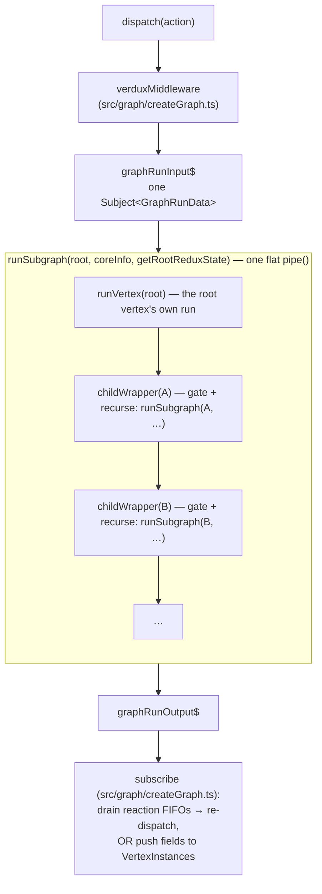
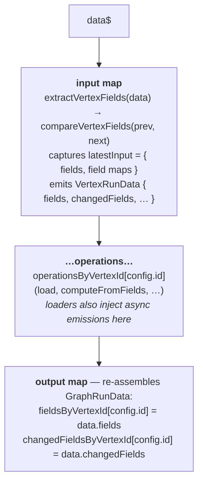
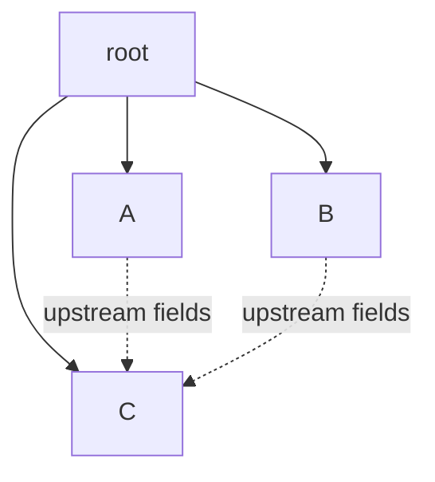

# verdux internals: the single linear pipeline

This document explains *how* a verdux graph actually runs — the RxJS pipeline that
turns each Redux action into a "graph run". It is aimed at contributors changing
anything under `src/run/`, `src/graph/`, or `src/operation/`. The README and
`CLAUDE.md` cover the public API and the high-level mental model; this file is about
the machinery underneath.

The one idea to hold onto: **a verdux graph — a DAG of vertices — is executed as a
single, flat, topologically-ordered RxJS pipeline.** There is no per-vertex
subscription graph that mirrors the DAG. There is one `Observable` chain, built once
at `createGraph` time, that every action and every async emission flows through from
front to back.

---

## 1. The pieces



Key files:

- `src/graph/createGraph.ts` — builds the Redux store + middleware, wires
  `graphRunInput$` → `runSubgraph(...)` → `graphRunOutput$`, and subscribes to the
  output to (a) re-dispatch reactions and (b) publish fields to subscribers.
- `src/run/runSubgraph.ts` — recursively builds the flat pipeline and holds the
  **change-detection gate** that lets a subgraph skip work.
- `src/run/runVertex.ts` — a single vertex's run: extract fields → run operations →
  re-assemble the `GraphRunData`.
- `src/run/RunData.ts` — the run-data types (`GraphRunData`, `VertexRunData`).
- `src/operation/*.ts` — the individual operators (`load`, `computeFromFields`,
  `reaction`, …) spliced into a vertex's run.

---

## 2. The value that flows: `GraphRunData`

A single value flows through the pipeline: `GraphRunData` (`src/run/RunData.ts`).

```ts
interface GraphRunData {
   action: UnknownAction | undefined
   fieldsByVertexId: Record<VertexId, VertexFields>           // computed/loaded fields per vertex
   changedFieldsByVertexId: Record<VertexId, VertexChangedFields>
   fieldsReactions, reactions, sideEffects                    // accumulated, drained downstream
   initialRun: boolean
}
```

`GraphRunData` is the **field channel**: each vertex's computed/loaded fields accumulate
on it as it flows, alongside the reactions and side-effects drained at the end of the run
(§7). It carries **no redux state** — the redux root lives in one place, the store, and
every vertex reads it live via `getRootReduxState()` (§6), then extracts *its own*
substate by walking a precomputed path from the root:

```ts
// extractReduxState(getRootReduxState(), coreInfo.reduxPathByVertexId[id])
//   = root.downstream[a].downstream[c]…   — this vertex's { vertex, downstream }
```

`reduxPathByVertexId[id]` (built in `computeGraphCoreInfo` from the
closest-common-ancestor tree) is the static list of `.downstream[name]` steps from
root to a vertex. This is the central design property: **every vertex is autonomous —
give it the live root and it derives its own slice; no parent hand-down, and nothing to
carry on `GraphRunData`.** The store is the single source of truth for a run's redux
state (§6).

---

## 3. One vertex's run (`runVertex`)

`runVertex(config, coreInfo, getRootReduxState)` returns a `GraphRun`
(`Observable<GraphRunData> → Observable<GraphRunData>`) with three stages:



- The **input map** is the only place `latestInput` is refreshed. It reads the
  vertex's slice via `extractVertexFields` (which walks `reduxPathByVertexId` from the
  live root, `getRootReduxState()`) and merges in tracked upstream fields.
- The **operations** are RxJS operators that transform `VertexRunData`. Most pass
  the value straight through. Some (`load`, `loadFromFields`, `reaction$`) also
  *inject additional emissions asynchronously* — see §5.
- The **output map** rebuilds `GraphRunData` from the operations' `VertexRunData` plus
  the captured `latestInput` (the field maps to merge this vertex's output into). Redux
  state is not part of `GraphRunData`; vertices read it live (§6).

---

## 4. Building the flat pipeline (`runSubgraph`) and the change-detection gate

`runSubgraph(config, …)` is:

```ts
pipe(
   runVertex(config, …),
   ...children.map(child => childWrapperGraphRun(child))
)
```

It chains the vertex's own run, then one wrapper per direct child, in topological
order (children are grouped by closest common ancestor in `computeGraphCoreInfo`).
Each child wrapper:

1. Decides whether the child subgraph should run at all:
   ```ts
   subgraphShouldRun(data) =
        reduxStateHasChanged(data)              // child's slice subtree changed by reference
     || hasTrackedAction(data)                  // action ∈ trackedActionsInSubgraph[child]
     || trackedUpstreamFieldHasChanged(child, data)  // an upstream field the child tracks changed
   ```
2. If it should run → `runSubgraph(child, …)` (recurse). If not → forwards the
   `GraphRunData` unchanged except clearing the child's `changedFieldsByVertexId`.
3. Merges run / not-run branches and restores `fieldsByVertexId` from the latest
   known input + output fields.

This gate is *the* mechanism that prevents needless recomputation and re-render:
a vertex is skipped unless its own Redux slice changed, an action it tracks fired,
or an upstream field it depends on changed.

`reduxStateHasChanged` is a **reference** comparison of the child's slice subtree —
`extractReduxState(getRootReduxState(), reduxPath[child])`, §2 — against the last one the
wrapper saw (`latestReduxState`). Immer/RTK give a new reference only for slices that
actually changed, so an unrelated action leaves a sibling's subtree reference intact
and the sibling is skipped. (The walk is O(depth) and allocation-free.) A vertex's
slice subtree reference changes
whenever *anything inside it* changes — including a descendant's slice — so a vertex
always re-runs when its own subtree mutates, but a *sibling* does not.

### Multi-upstream vertices: the dependency DAG vs. the redux tree

The pipeline has looked tree-shaped so far, but verdux vertices form a **DAG**: a
vertex can declare *several* upstreams (`configureVertex(…, _ => _.addUpstreamVertex(X)
.addUpstreamVertex(Y))`, or the `upstreamFields` option of
`configureDownstreamVertex`) and pull fields from each. There are really **two
overlaid structures**:

- **The dependency DAG** — vertices joined by *upstream-field* edges.
  `config.upstreamVertices` lists a vertex's upstreams; `builder.fieldsByUpstreamVertexId`
  records which fields it pulls from each.
- **The redux / execution tree** — the subgraph nesting from above, where each vertex
  sits under the **closest common ancestor** of all its upstreams
  (`findClosestCommonAncestor` → `vertexConfigsByClosestCommonAncestorId`). For a
  single-upstream vertex that ancestor *is* its upstream; for a multi-upstream vertex
  it's the deepest vertex that is an ancestor of every upstream.



Solid edges are the redux / subgraph nesting; dashed edges are dependency
(upstream-field) edges. The two disagree here: C depends on **A and B**, but its
closest common ancestor is **root**, so C is nested directly under root — its
`reduxPathByVertexId` is `root → C`, *not* through A or B. The pipeline executes the
tree; the DAG edges are satisfied through two separate mechanisms:

1. **Field flow rides the accumulating `GraphRunData`.** The flat pipeline is topologically
   sorted (`indexWithDownstreamVertices` places a vertex only once *all* its upstreams
   are already sorted), so A and B both run before C. Each `runVertex` writes
   `fieldsByVertexId[selfId]` and the entries accumulate as `GraphRunData` flows — even a
   *skipped* upstream keeps its last fields in `GraphRunData` (the wrapper re-merges
   `latestOutputFieldsByVertexId`). So by the time C runs, `fieldsByVertexId` already
   holds A's and B's fields, and `extractVertexFields` (§3) reads each upstream's
   fields straight out of `data.fieldsByVertexId[upstreamVertex.id]`, regardless of
   which subgraph branch produced them.
2. **Cross-edge change detection is the gate's third condition.** C's redux slice may
   be unchanged and its redux parent (root) untouched, yet C must still re-run when A's
   or B's fields change. That is exactly `trackedUpstreamFieldHasChanged(C, data)`: it
   checks `changedFieldsByVertexId[upstreamId]` for each field C pulls. This is the DAG
   edge expressed in the gate.

So a multi-upstream vertex still has exactly **one** redux path (the redux tree has no
cross-edges) even though it has multiple dependency edges — the DAG lives only in the
field channel and the gate, never in the redux-state derivation.

---

## 5. Two kinds of run: full runs and partial runs

Every value flowing through the pipeline belongs to one of two kinds of run. This
distinction is central to the design; it shapes how each run obtains its redux root (§6).

- **Full run** — started by a dispatched action (or the one-off initial run). The
  middleware seeds a `GraphRunData` at `graphRunInput$` and it flows through the *whole*
  pipeline, top to bottom; each vertex's gate (§4) decides whether to recompute.
- **Partial run** — started when a **loader emits a new value** asynchronously. There
  is no action and the store has not changed; only the part of the pipeline
  **downstream of the emitting vertex** runs. Upstream vertices — and the emitter's own
  input/extraction stage — are never re-entered.

The partial run is what makes loaders feel reactive: a `load`ed value can arrive long
after the action that requested it, and when it does, only the vertices that *consume*
it should recompute.

### How a partial run is injected

Most operations are pure pass-through maps. Loaders are not. `src/operation/load.ts`
merges two streams:

```ts
return merge(
   passingThrough$,   // 1 emission per input — part of the full run (current loading/loaded fields)
   delayedLoaded$     // N async emissions — each one starts a partial run (one per loader value/error)
)
```

`delayedLoaded$` subscribes to the user's loader observable(s) and, whenever a loader
emits, produces a fresh `VertexRunData` carrying the new value:

```ts
{ action: undefined, initialRun: false, fields: { …latestInputFields, …outputFields }, … }
```

Four facts about that injected emission:

- **It is injected between `runVertex`'s input map and its output map** — inside the
  operations — so it does *not* pass back through the input map. `latestInput`
  (captured by the input map) is therefore **not** refreshed for a partial run.
- **`action: undefined`** — a partial run is not "an action", so `hasTrackedAction` is
  false downstream; it propagates purely through field- and redux-change detection.
- **It flows forward only.** It exits the emitter's output map and continues through
  every wrapper *after* the emitter — the emitter's own children plus its
  later-registered siblings and their subtrees — never back to earlier wrappers. (This
  is why sibling registration order matters.)
- **Its `changedFields` is computed, not assumed.** A loader flags its field changed
  only when the new value actually differs from the field's previous status / value /
  errors — via `compareVertexFields`, the same helper `computeFromFields` uses. A loader
  re-emitting a **reference-identical** value therefore produces an **empty**
  `changedFields`: the downstream gate (§4) skips and change-gated reads (`pick`) do not
  re-fire. Identical re-emission is a no-op, and must stay one — all three loaders
  (`load`, `loadFromFields`, `loadFromFields$`) share this rule.

### Redux state on a partial run

A partial run recomputes the emitter's downstream consumers, and a recomputing vertex
reads its **own redux slice** (`extractVertexFields`, §3), not only the upstream field
that changed. It reads that slice live from the store (§6) — the injected emission
carries only the new field value, nothing redux-related.

---

## 6. Reading the root from the live store

> **Redux state is never carried on `GraphRunData`. Wherever a vertex needs its slice —
> the input map's field extraction (§3) and the change-detection gate (§4) — it reads the
> root live from the store via `getRootReduxState()` and walks its own
> `reduxPathByVertexId` (§2).** A loadable emission runs no reducer, so the live store
> already holds the correct state for every vertex.

`getRootReduxState` is `() => reduxStore.getState()`, created in `createGraph` and threaded
through `runSubgraph` into every `runVertex` and every gate. The store is the only redux
source; there is no snapshot on the value flowing through the pipe.

One source serves the whole pipeline at every depth: every vertex derives its own slice
from the store's current root (§2), so there are no per-vertex copies to keep in sync.

The live read is correct for both kinds of run:

- **Partial run (loadable emission).** No dispatch happened, so the store still holds the
  redux state left by the most recent action. Reading it live hands each downstream
  vertex its current slice.
- **Full run.** The store equals the run's root throughout: re-dispatches (reactions)
  happen only in the terminal `subscribe`, after the whole pipe has run (§7), so the
  store can't mutate mid-run.

`src/run/staleSnapshotRevert.test.ts` covers this across root-level and deeply-nested
siblings, both sibling registration orders, `loadFromFields`, and multiple concurrent
loadables.

---

## 7. The output side: reactions, FIFO re-dispatch, field publication

`graphRunOutput$.subscribe` in `createGraph` finishes each run:

- It pushes any `fieldsReactions` / `reactions` / `sideEffects` accumulated in the
  `GraphRunData` onto FIFO queues.
- If a reaction queue is non-empty, it **re-dispatches** the next reaction through
  Redux (`reduxStore.dispatch`), which re-enters the middleware and produces a *new*
  graph run. Changed fields are accumulated across these re-dispatch hops
  (`saveChangedFields`) so the eventual field publication reflects the whole cascade.
- Once no reactions remain, it publishes fields to each `VertexInstance` via
  `__pushFields(fields, changedFields)` and runs queued side effects.

This re-dispatch loop is why the store stays constant through a synchronous run (§6):
each re-dispatch is its own fresh middleware-seeded run; runs never interleave.

The subscription also has an `error` handler, but it is **fail-fast observability only**:
if a run errors (an operation let a throw or erroring stream escape), it logs a diagnostic
and the subscription terminates — the graph stops publishing. It does *not* resubscribe.
This is a deliberate liveness-vs-consistency choice: by the time an error reaches the
subscription the run is already torn down, so resuming would run the app on inconsistent
state. Operations are therefore required to contain their own runtime errors (§8.5).

---

## 8. Invariants to preserve when changing the pipeline

If you touch `src/run/` or `src/operation/`, keep these true:

1. **Each vertex derives its own substate from the root via `reduxPathByVertexId`
   (`extractReduxState`)** — the store is the single source of truth for a run's redux
   state. Don't add per-vertex copies that could drift from it.
2. **Change-detection gating must stay reference-based and side-effect-free**
   (the `shouldRun` computation in `runSubgraph`); don't make it depend on mutable
   captured state that async emissions can desync. A field-producing operation flags a
   field changed only when it *actually* changed (`compareVertexFields`), so re-emitting
   a reference-identical value is a no-op — see §5's fourth fact.
3. **The pipeline is forward-only and topologically ordered.** An async emission
   reaches later siblings but not earlier ones — don't write operations that assume
   otherwise.
4. **Sibling order is significant.** Tests that exercise loadables should cover both
   "loadable-owner registered before the plain sibling" and after.
5. **Every operation contains its own *runtime* errors.** A throw or erroring stream from
   a user callback must be caught *inside* the operation and degraded locally; it must not
   propagate to `graphRunOutput$`. The one deliberate exception is a **return-contract
   breach** — an Observable-returning loader/computer/mapper that throws when called or
   returns a non-Observable is a programming error and *fails fast* on purpose (it is not
   caught). The graph-level `error` handler in `createGraph` is a fail-fast tripwire (logs,
   then the graph stops) — explicitly *not* a recovery boundary (§7). The full rules (field
   ops → `error`-status field, no logging; effect ops → log and skip; return-contract
   breaches → fail fast), invariants, and the required full-graph error test are the single
   source of truth in **`src/operation/OPERATION_CONTRACT.md`**.
