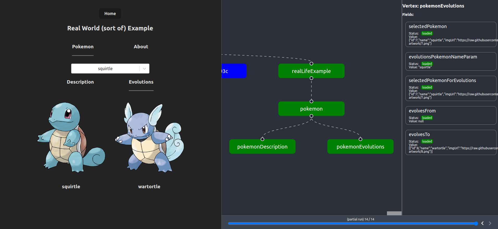

# verdux

#### Redux + RxJS + TypeScript = ❤️

> Model your application as a reactive, directed acyclic graph.
> A graph is composed of vertices. Hence the name (vertex + redux = verdux). Duh.

## Table of Contents

<!-- START doctoc generated TOC please keep comment here to allow auto update -->
<!-- DON'T EDIT THIS SECTION, INSTEAD RE-RUN doctoc TO UPDATE -->

- [Motivation](#motivation)
- [What is `verdux` ?](#what-is-verdux-)
- [Features](#features)
- [Examples](#examples)
- [DevTools (WIP)](#devtools-wip)
- [But `redux` sucks, right ?](#but-redux-sucks-right-)
- [Install](#install)
- [Testing](#testing)

<!-- END doctoc generated TOC please keep comment here to allow auto update -->

## Motivation

##### After years of maintaining frontend applications, we have come to realize that :

- The human brain is naturally wired to process tree-like structures
- UI applications are most intuitively respresented as hierarchical graphs
- Asynchronicity is an essential dimension of frontend apps, and the source of most accidental complexity
- Reactive programming is just too powerful a tool not to use

## What is `verdux` ?

##### `verdux` is a state management + asynchronous orchestration library that :

- Models UI application state as a flow of data streaming through a directed acyclic graph
- Allows better separation of concern, each vertex in the graph is self-contained and self-sufficient
- Is designed from the ground up to provide maximum type safety
- Embraces asynchronicity in its core using the power of `RxJS`
- Reduces accidental complexity for most typical front UI cases
- Prevents unnecessary re-rendering, without any manual memoization

## Features

- Integration with vanilla `redux` and `redux-toolkit`
- Declarative data fetching supporting cascade loading
- Automatic refetching and error propagation
- Epics, just like [`redux-observable`](https://github.com/redux-observable/redux-observable), our favorite redux middleware
- Some other cool stuff

## Examples

https://github.com/couzic/verdux-examples

## DevTools (WIP)



## But `redux` sucks, right ?

A lot of people have complained about `redux`, some with good reason. Many have been drawn to other state management solutions.

> Don't throw the baby with the bathwater.

Although we agree there must be a better way than classical `redux`, we are not willing to sacrifice all of the `redux` goodness you've heard so much about.

> Making redux great again !

## Install

```bash
npm install verdux @reduxjs/toolkit rxjs
```

### Create

#### `configureRootVertex()`

Create a root vertex configuration. Only one by graph.

```ts
import { createSlice } from '@reduxjs/toolkit'
import { configureRootVertex } from 'verdux'

// Just a regular redux-toolkit slice
const slice = createSlice({
   name: 'root',
   initialState: {},
   reducers: {}
})

const rootVertexConfig = configureRootVertex({ slice })
```

#### `createGraph()`

Create a graph with vertex configurations.

```ts
import { createGraph } from 'verdux'
import { userVertex } from './userVertex'
import { todosVertex } from './todosVertex'

const appGraph = createGraph({
   vertices: [rootVertexConfig]
})

const rootVertex = appGraph.getVertexConfig(rootVertexConfig)
```

### Computed values (synchronous)

#### `computeFromFields()`

Compute derived values from vertex fields.

```ts
import { createSlice } from '@reduxjs/toolkit'
import { configureRootVertex } from 'verdux'

const userVertexConfig = configureRootVertex({
   slice: createSlice({
      name: 'user',
      initialState: {
         firstName: 'John',
         lastName: 'Doe'
      },
      reducers: {}
   })
}).computeFromFields(['firstName', 'lastName'], {
   fullName: ({ firstName, lastName }) => `${firstName} ${lastName}`
})
```

### Loading data

#### `load()`

Immediately initialize loaded data.

```ts
import { createSlice } from '@reduxjs/toolkit'
import { ajax } from 'rxjs/ajax'
import { configureRootVertex } from 'verdux'

const todosVertexConfig = configureRootVertex({
   slice: createSlice({
      name: 'todos',
      initialState: {},
      reducers: {}
   })
}).load({
   items: ajax.getJSON(`https://www.base.url/todos`)
})
```

#### `loadFromFields()`

Load data based on vertex fields.

```ts
const todoVertexConfig = configureRootVertex({
   slice: createSlice({
      name: 'todo',
      initialState: {
         id: '123'
      },
      reducers: {}
   })
}).loadFromFields(['id'], {
   details: ({ id }) => ajax.getJSON(`https://www.base.url/todos/${id}`)
})
```

### Consuming the state

#### `vertex.currentState`

Synchronous read of vertex current state.

```ts
const todoVertex = appGraph.getVertex(todoVertexConfig)
console.log(todoVertex.currentState.id) // '123'
```

#### `vertex.state$`

Observable state

```ts
const todoVertex = appGraph.getVertex(todoVertexConfig)
todoVertex.state$.subscribe(state => {
   console.log(state.details) // Logs the return from AJAX call
})
```

### Actions and Reactions

#### `reaction()`

Dispatch an action in reaction to another action.

```ts
const slice = createSlice({
   name: 'counter',
   initialState: {
      count: 0
   },
   reducers: {
      buttonClicked: () => {},
      increment: state => {
         state.count++
      }
   }
})

const { buttonClicked, increment } = slice.actions

export const counterVertexConfig = configureRootVertex({
   slice
}).reaction(buttonClicked, () => increment())
```

#### `reaction$()`

Handle asynchronous reactions with RxJS.

```ts
import { createSlice } from '@reduxjs/toolkit'
import { map, pipe, throttleTime } from 'rxjs'
import { configureRootVertex } from 'verdux'

const slice = createSlice({
   name: 'counter',
   initialState: {
      count: 0
   },
   reducers: {
      buttonClicked: () => {},
      increment: state => {
         state.count++
      }
   }
})

const { buttonClicked, increment } = slice.actions

export const counterVertexConfig = configureRootVertex({
   slice
}).reaction$(
   buttonClicked,
   pipe(
      throttleTime(500),
      map(() => increment())
   )
)
```

#### `sideEffect()`

Declare side effects to be synchronously executed in response to actions.

```ts
const slice = createSlice({
   name: 'analytics',
   initialState: {
      events: []
   },
   reducers: {
      trackEvent: (state, action) => {
         state.events.push(action.payload)
      }
   }
})

export const analyticsVertexConfig = configureRootVertex({
   slice
}).sideEffect(slice.actions.trackEvent, action => {
   trackingApi.sendEvent(action.payload)
})
```

## Testing

> Testing an action creator, a reducer and a selector in isolation.


> "Looks like it’s working !"

Testing in `redux` usually implies testing in isolation the pieces that together form the application's state management system. It seems reasonable, since they are supposed to be pure functions.

Testing in `verdux` follows a different approach. A vertex is to be considered a cohesive **unit** of functionality. We want to **test it as a whole**, by interacting with it like the UI component would. We do not want to test its internal implementation details.

### Test Setup

Each test should run in isolation, therefore we need to create a new graph for each test.

```ts
describe('Counter Vertex', () => {
   let graph: Graph
   let counterVertex: Vertex<typeof counterVertexConfig>
   beforeEach(() => {
      graph = createGraph({
         vertices: [counterVertexConfig]
      })
      counterVertex = graph.getVertexInstance(counterVertexConfig)
   })

   it('should increment counter', () => {
      // Most tests should limit themselves to dispatching actions and verifying that the state has correctly updated.
      graph.dispatch(counterActions.increment())
      expect(counterVertex.currentState.count).to.equal(1)
   })
})
```
